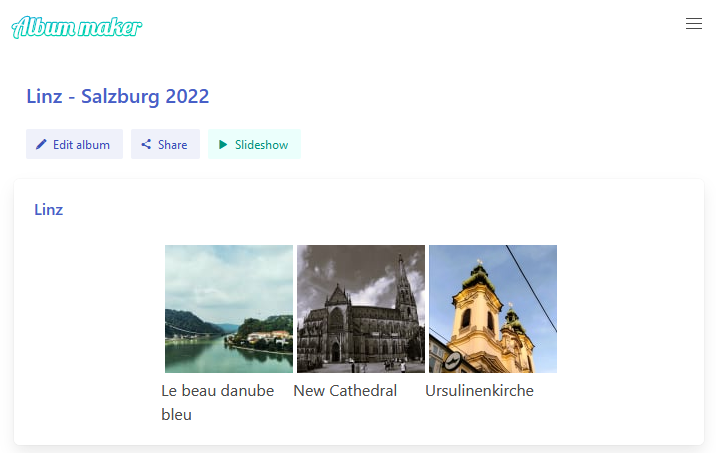

# album_maker



## Install / check required tools

Make sure you have basic tools installed:

- [Rust](https://www.rust-lang.org)
- [cargo-make](https://sagiegurari.github.io/cargo-make/)

Add WASM Target : `rustup target add wasm32-unknown-unknown`

## Configure

Configure environment variables :

Copy the file `.env.example` to a new file named `.env` 
And set your variables in this file

## Run

1. Open a new terminal and run: `cargo make serve`
1. Open a second terminal run: `cargo make watch`

## Lint

Run `cargo make verify` in your terminal to format and lint the code.

## Docker

1. Build : `docker build . -t tuntematonsotilas/gbt:amaker`
1. Run : `docker run -p 8080:80 tuntematonsotilas/gbt:amaker`
1. Test : http://localhost:8080
1. Push `docker push tuntematonsotilas/gbt:amaker`

## Deploy to Koyeb 
Initialize the App
```sh
koyeb app init amaker --git-docker-dockerfile "https://github.com/TuntematonSotilas/album_maker/blob/master/dockerfile"
```
Get Services
```sh
koyeb services list
```
Update Service
```sh
koyeb services update 1b68cac4 --git-docker-dockerfile "https://github.com/TuntematonSotilas/album_maker/blob/master/dockerfile"
```
